 
### 1. Descrição do projeto

 Quantificar o risco a que estes caminhoneiros estão submetidos,
os dados coletados e analisados anteriormente, serão aplicados a uma coletânea de 
algoritmos de classificação, disponibilizados em linguagem Pyhton através das 
bibliotecas de aprendizagem de máquina, Sklearn, Lightgbm e Xgboost.

### 2. Catálogo de dados

|Categoria | tipo |
|----------|------|
|fumante  |  object|
|bebidas | object
|drogas| object
|acidentes|        float64
|trabalho excessivo|    object
|posicao incomoda|       object
|horas dormindas|    float64
|fss|                   float64
|fadiga|               float64
|horas trabalhadas|     float64
|ess |                  float64
| fumante|object
|Idade |object|
|Dogras| object|

### 3. Exploração de dados

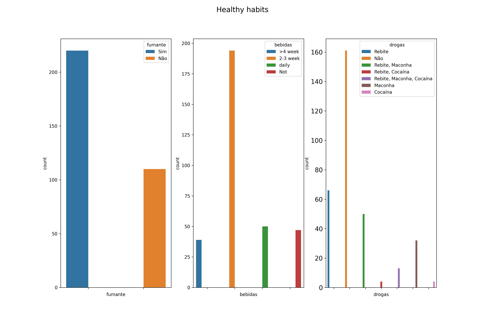

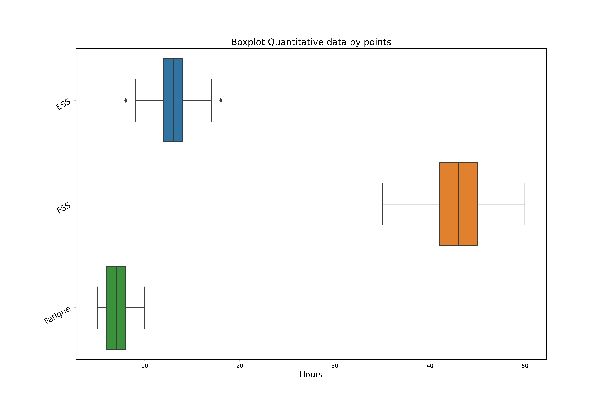

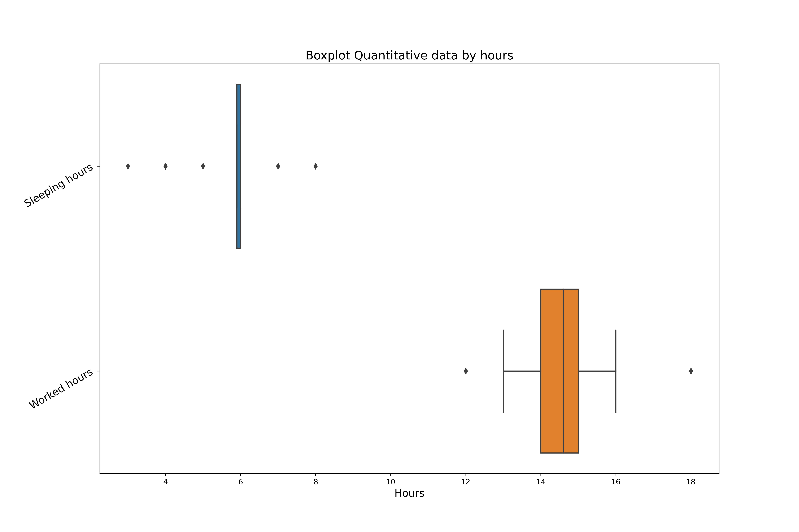

### 4. Algoritmos classificadores
 
 A fim de quantificar o risco a que estes caminhoneiros estão submetidos,os dados coletados e analisados anteriormente, serão aplicados a uma coletânea de algoritmos de classificação, disponibilizados em linguagem Pyhton através das bibliotecas de aprendizagem de máquina, Sklearn, Lightgbm e Xgboost. 

#### 4.1 GaussianNB  
 
 Consiste em um tipo de aprendizagem supervisionada baseada na aplicação do Teorema de Bayes, para isto,assume como hipótese a independência de probabilidade 
 para o cálculo das probabilidades condicionais. (SCIKIT LEARN ORG., 2022). 

#### 4.2 KNeighbors
 
 A classificação baseada em vizinhos é um tipo de aprendizagem baseada em instâncias ou aprendizagem não generalizante: ela 
 não tenta construir um modelo interno geral, mas simplesmente armazena instâncias dos dados de treinamento. A classificação é  calculada a partir de uma maioria simples de votos dos vizinhos mais próximos de cada ponto: (SCIKIT LEARN ORG., 2022)
 

#### 4.3 Decision Tree
 
 As Árvores de Decisão (DTs) são um método de aprendizado supervisionado não paramétrico usado para classificação e regressão. O objetivo é criar um modelo que preveja o valor de uma variável de destino aprendendo regras de decisão simples inferidas dos recursos de dados. Uma árvore pode ser vista como 
 uma aproximação constante por partes. (SCIKIT LEARN ORG., 2022)
 

#### 4.3 RandomForest
 
  O classificador Random Forest é uma meta estimador que ajusta vários classificadores de árvore de decisão em várias subamostras do conjunto de dados e usa a média para melhorar a precisão preditiva e controlar o excesso de ajuste: (SCIKIT LEARN ORG., 2022)
 

#### 4.4 SVM 
 
 A implementação é baseada em libsvm. O tempo de ajuste escala pelo menos quadraticamente com o número de amostras e pode ser impraticável além de dezenas de milhares de amostras. Para grandes conjuntos de dados, considere usar LinearSVC ou SGDClassifier, possivelmente após um transformador Nystroem. (SCIKIT LEARN ORG.,2022)
 

## 4.5 LogisticRegression
 
 A regressão logística é um caso especial de Modelos Lineares Generalizados com uma distribuição condicional binomial/Bernoulli e um link Logit. A saída numérica da  regressão logística, que é a probabilidade prevista, pode ser usada como um classificador aplicando-lhe um limite (por padrão 0,5). 
 É assim que é implementado no scikit-learn, então ele espera um alvo categórico, tornando a Regressão Logística um classificador. (SCIKIT LEARN ORG, 2022)
 

#### 4.6 LightGBM
 
LightGBM usa algoritmos baseados em histogramas que agrupam valores de recursos (atributos) contínuos em compartimentos discretos. Isso acelera o treinamento e 
 reduz o uso de memória. (LIGHTGBM, 2022)
 

#### 4.7 LightGBM
 
 O XGBoost é uma biblioteca otimizada de aumento de gradiente distribuída projetada para ser altamente eficiente, flexível e portátil. Ele implementa algoritmos de aprendizado de máquina sob a estrutura Gradient Boosting. (DMLC XGBOOST, 2022)

### 5. Matriz de confusão

 
 A execução do procedimento metodológico para o desenvolvimento das aplicações em aprendizagem máquinas descritas anteriormente, deve ser capaz de viabilizar a obtenção de resultados preditivos com elevados níveis de 
 acurácia, permitindo assim, a correta mensuração dos riscos a que os caminhoneiros estão submetidos e a atuação preventiva de modo a se mitigar os índices de acidentes, evitando-se assim perdas humanas, materiais,redução dos custos operacionais e até mesmo subsidiar discussões a respeito das politicas voltadas a esta categoria.

 Neste sentido, os algoritmos classificadores aqui       empregados, devem ser capazes superar a natureza aleatória da ocorrência do sinistro, assim estes devem fornecer predições com valores superiores a 50%, pois assumisse aqui 
que um determinado motorista item iguais chances de se envolver ou não em um acidente. Assim, uma primeira avalição na qual os algoritmos são submissos consiste na obtenção da matriz de confusão deste. 

 

### 6.  Validação cruzada k-fold 
 
 Para cada um dos algoritmos a estratégia K-fold Cross Validation foi executada 40 vezes, sendo que, em cada uma delas, foi considerada 10 partições distintas da base de dados, obtendo-se em cada uma delas a previsão de um caminhoneiro de envolver em um acidente.
 

 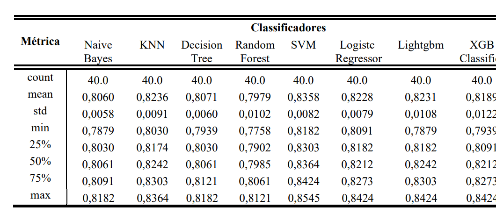

 
 A coletânea de todas as previsões realizadas durante o processo de validação, permite obter a distribuição da acurácia para cada um dos algoritmos classificadores, 
 comom é mostrada na imagem a seguir.
 

 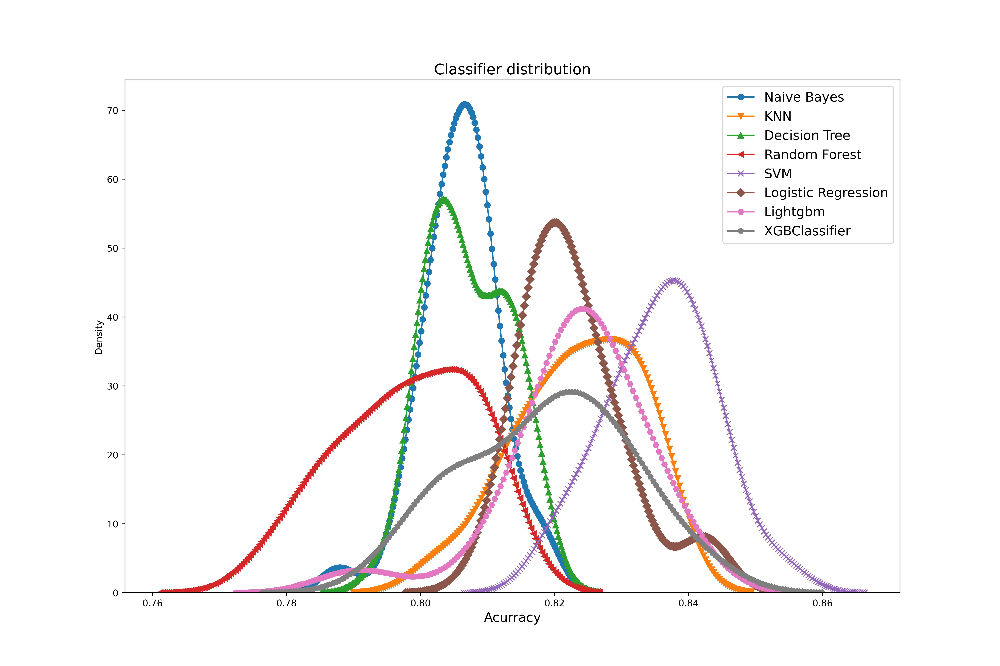

 
  Além disso, estes dados também podem ser  estudados através da ferramenta boxplot, mostrada na imagem seguir.
 

 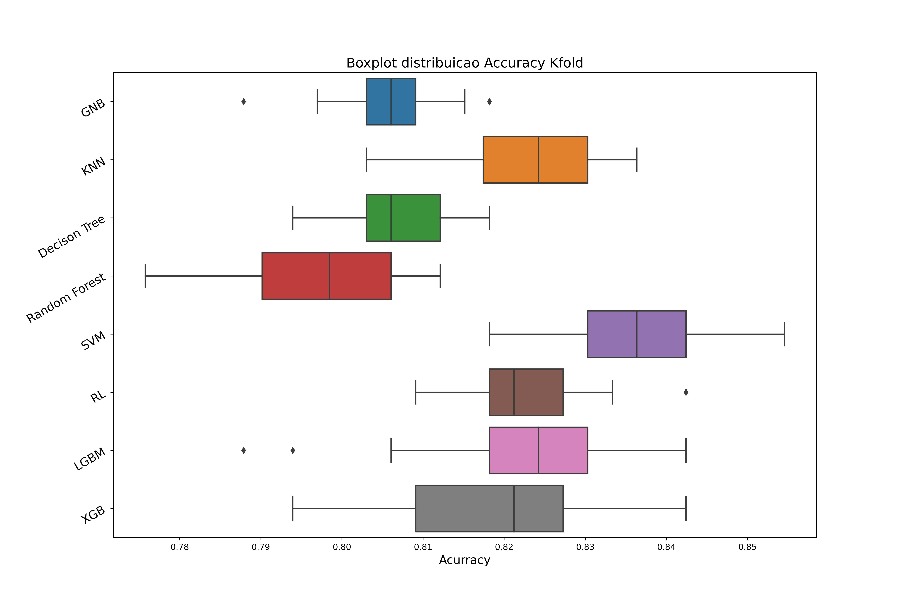
  
 

 Ao analisar conjuntamente as duas imagens anteriores, pode-se concluir que o
 conjunto de algoritmos aqui empregados, atestam como risco de um caminhoneiro se 
 envolver em acidentes probabilidades que variam entre 78% e 85%, o que se mostra 
 significativo como um alerta para a prevenção deste. Além disso, estes dados revelam a 
 eminência de um colapso destes trabalhadores, pois estes estão assumindo um risco de 
 maior de 78% de sofrerem acidentes ao iniciarem sua jornada de trabalho. 

### 7.  Teste de Shapiro-Wilk 
  

   A tabela a seguir reúne os resultados do teste de Shapiro-Wilk (1965) 
 considerando um nível de confiança de 95%. Assim, conclui-se que as curvas geradas 
 pelos classificadores Naive Bayes, KNN, Random  Forest, SVM, XGBClassifier, são
 normalmente distribuídas, enquanto, os classificadores Decision Tree, Logistc Regressor e lightgbm geram curvas que não se distribuem normalmente. Este teste é importante,pois permite identificar sobre quais curvas devem se aplicar testes paramétricos e sobre quais iremos aplicar os testes não paramétricos.
 

  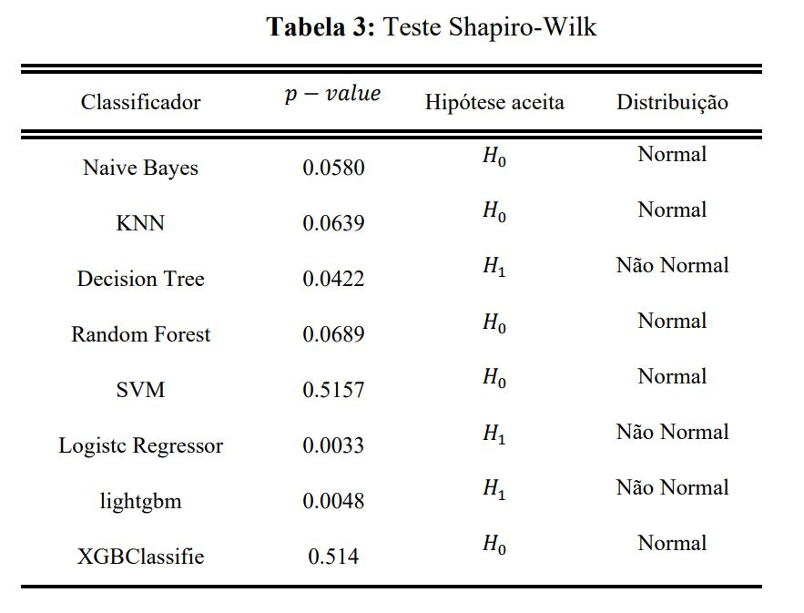
 
 

  Um modo de visualizar a normalidade das curvas dos classificadores, consiste em 
 distribuir os pontos destas sobre a reta QQ-Plot, assim, espera-se que estes se distribuam  sobre elas. As imagens a seguir, mostram retas as QQ-plot, para curvas que passam no  teste de Shapiro-Wilk (1965)
 

  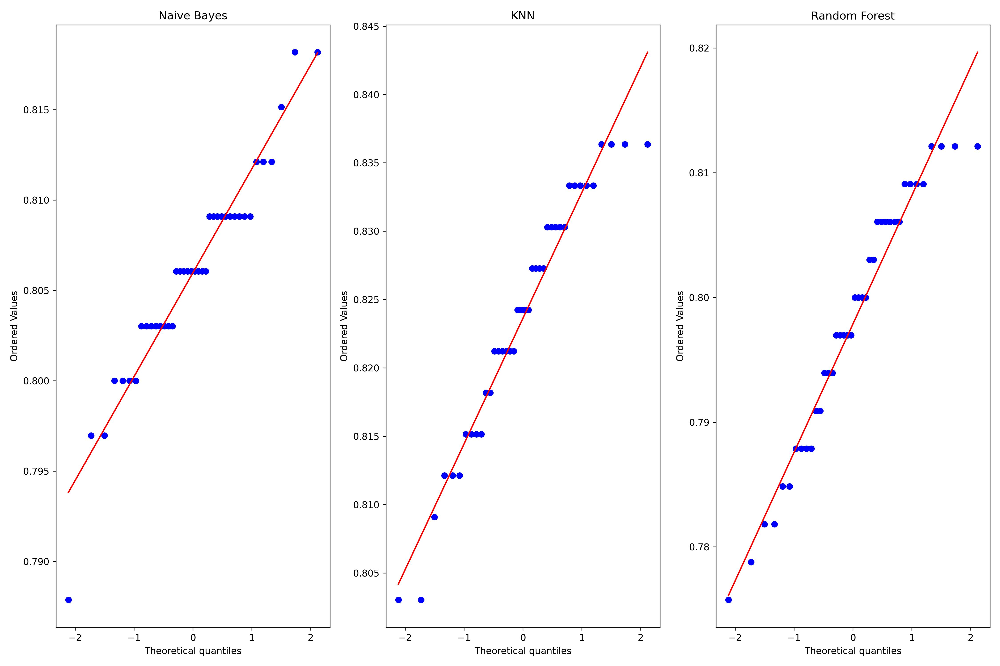

  

 #### 7.1 - Teste paramétricos 

 

 Para o presente estudo, o Teste de hipótese ANOVA e Tukey forma aplicados 
 considerando-se 95% de confiança. O primeiro deles taesta a existência de diferença 
 significativa entre as médias, assim, pode-se então aplicar o teste de Tukey cujos 
 resultados estão elencados na tabela a seguir. a seguir, nesta tabela 𝐻0 a hipótese nula,que assume que as medias são iguais, enquanto 𝐻1 a hipótese alternativa que considera que os dados são estatisticamente diferentes
 

 #### 7.1.1 - Teste ANOVA
 
 Ao nível de confiança de 95% o teste ANOVA garante que existe diferença estatica entre os dados.

 

 #### 7.1.2 - Teste de Tukey
  teste de Tukey cujos 
 resultados estão elencados na tabela a seguir, nesta tabela 𝐻0 a hipótese nula,
 que assume que as medias são iguais, enquanto  𝐻1 a hipótese alternativa que considera que os dados são estatisticamente diferentes

 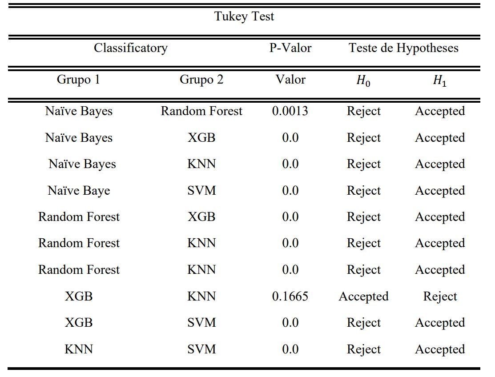 

 

 Uma das formas de visualizar as comparações realizadas pelo teste de Tukey, é através da múltipla comparação de Tukey, como mostrado a seguir. Desta imagem,podemos concluir que o algoritmo SVM se destaca neste grupo, pois apresenta a maior média.
 

 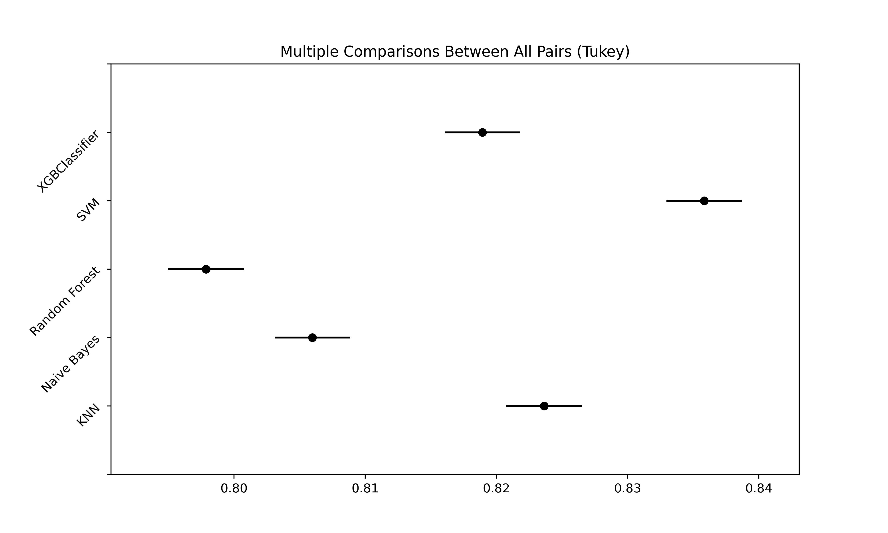

#### 7.2 - Teste não paramétricos

 Procedendo de maneira análoga para os classificadores cujas distribuições não 
 foram consideradas normalmente distribuídas pelo teste de Shapiro-Wilk, ou seja, os 
 classificadores Decision Tree, Logistc Regressor, lightgbm, deve-se então aplicar os teste não paramétricos de Kruskal e Dunn, a fim de compreender o comportamento entre as médias destes classificadores.

#### 7.2.1 - Teste de  Kruskal

O teste de hipótese de Kruskal, com devido grau de confiança, assume como 
hipótese nula 𝐻0 as médias serem estatisticamente iguais para todas as curvas, quanto que 
a hipótese alternativa 𝐻1 assume que existe diferença estatística significativa elas. 
Contudo, assim como o teste paramétrico de ANOVA o teste de Kruskal não permite 
identificar onde corre a diferença, o mapeamento desta fica a cargo do Teste de Hipótese
de Dunn., que com devido nível de confiança, testa as médias duas a duas, considerando 
como nula 𝐻0 que assume igualdade entre elas, e a hipótese alternativa 𝐻1 que considera 
a existência de diferença entre elas.

#### 7.2.2 - Teste de Dunn
 

 Ao nível de confiança de 95% o teste de hipótese de Kruskal conclui que existe
 diferença estatística significativa entre as medias dos classificadores Decision Tree, 
 Logistc Regressor, lightgbm. Assim , aplicando o Teste de hipótese de Dunn com o 
 mesmo nível de confiança anterior, aos classificadores já elencados se obtem a imagem a seguir:
 

 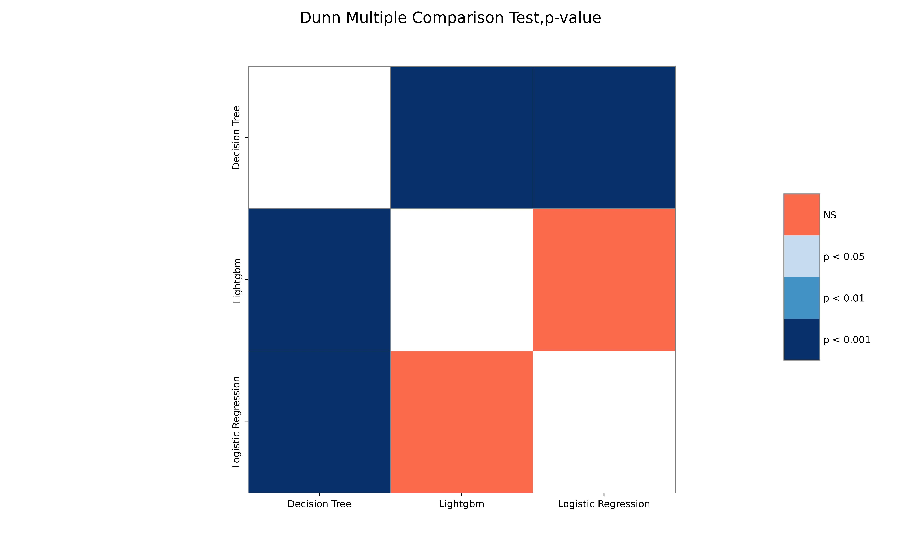